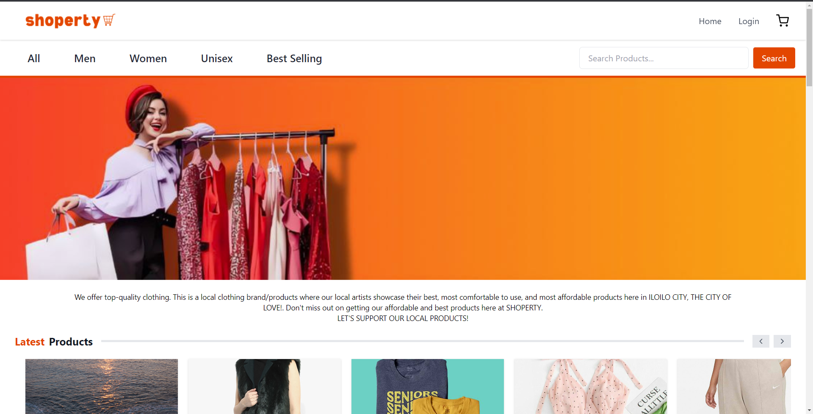
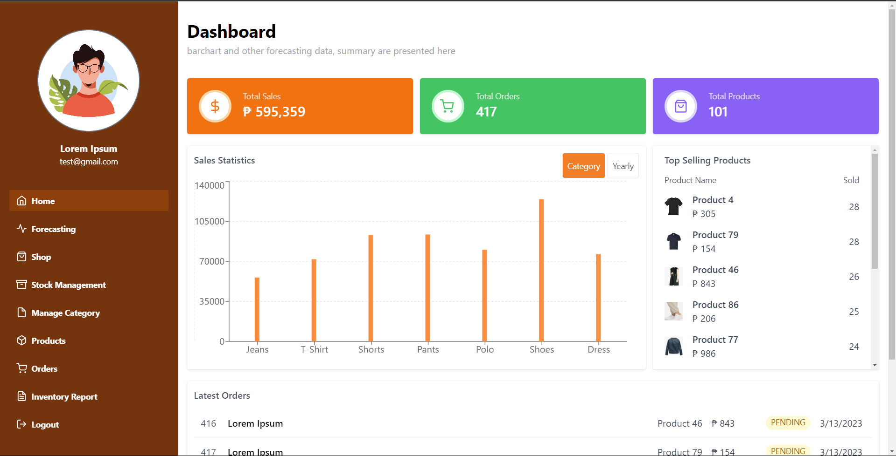
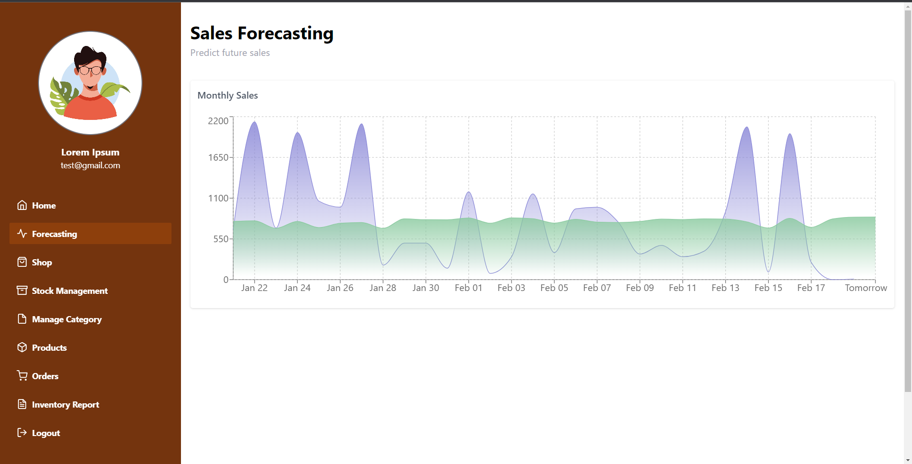
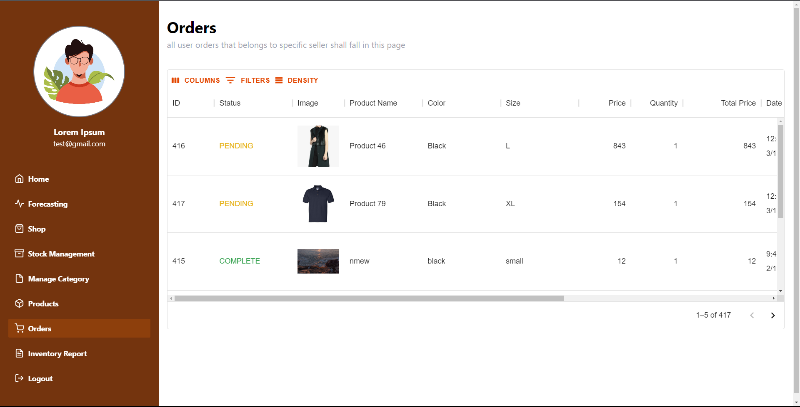
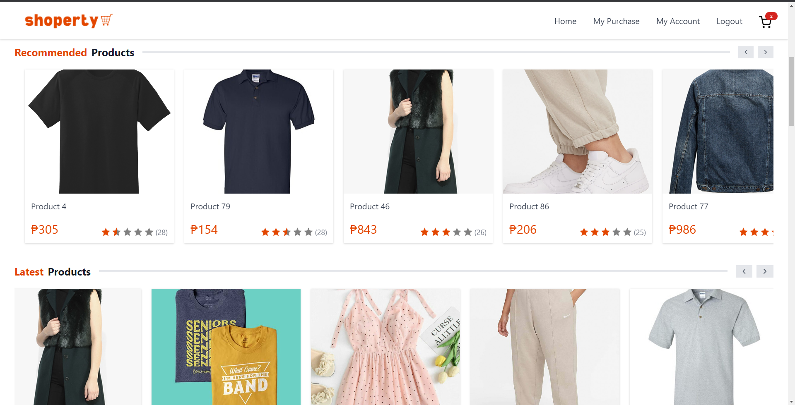
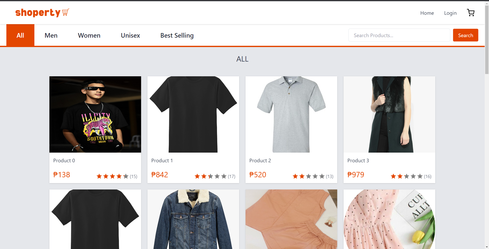
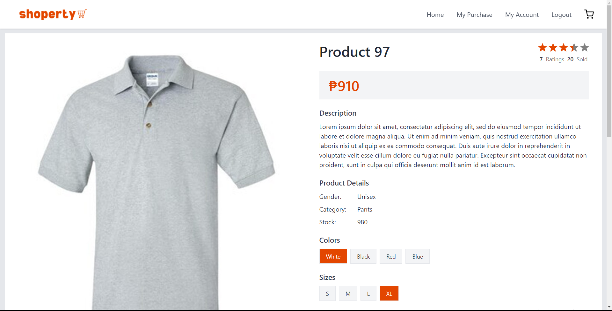

# Shoperty
Shoperty is an e-commerce website that provides an easy and convenient way to buy and sell local products. 



## Features
- Login/Signup for seller & buyer
- Add to cart 
- Purchase products (without billing)
- Product ratings
- Product recommendation using collaborative filtering algorithm.
- Inventory Management
- Sales visualization
- Sales forecasting

## Seller



## Buyer





## Technology
- Python, Flask, Flask-SQLAlchemy
- React JS, Tailwind CSS, Recharts

## Requirements
1. Python
2. Node JS

## Backend
1. Set directory to backend:
```
cd backend
```
2. Setup and activate virtual environment
```
python -m venv venv
venv/Scripts/activate
```
3. Install required python dependencies
```
pip install -r requirements.txt
```
4. Run Flask App
```
flask run
```

## Frontend
1. Set directory to frontend:
```
cd frontend
```
2. npm install
```
npm install
```
2. npm start
```
npm start
```